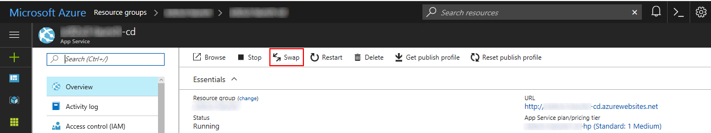

# Azure Deploy Templates
The files in this repository are used to deploy Launch Sitecore to an Azure XP environment using Sitecore 8.2 Update 3. I would like to thank [Rob Habraken](https://www.robhabraken.nl/) for his excellent articles, samples and tools for Sitecore Azure Deployments. His articles were a big help building these scripts.

# Launch Sitecore in an Azure XP cloud deployment

The Launch Sitecore site is a good starting point for testing Sitecore deployments. It is a fairly simple site that demonstrates many different sitecore features. This makes it ideal for a test environment.

In this post, I will document the steps taken to deploy Launch Sitecore into the Sitecore Azure XP Environment. I will also show how to setup the CD using Blue/Green code deployments. Other servers in the environment could be deployed this way if needed.

## The Tools
The list of tools was chosen to keep the environment as simple as possible. These tools are standard in most Sitecore development environments

1. The Sitecore 8.2.3 XP deployment files.
1. The Azure hosting environment
1. Team Development for Sitecore Classic
1. Visual Studio Online with a build server 
1. Launch Sitecore
1. VS Code
1. Microsoft Azure Storage explorer

## Setup Launch Sitecore Build
The first step is to actually build Launch Sitecore on a build server. We want to build an MSDeploy package for code and a Sitecore Update Package for the Launch Sitecore items.

### Creating the projects
A local development environment for Launch Sitecore needs t obe built. The files in the the VS solution were added to a VSO project and two TDS Classic projects were added to the soltuion. One for the Core database and one for Master.

The items in the Launch Sitecore package were added to the TDS projects and everything was commited to the VSO source code repository.

The LaunchSitecore.Master project was setup to bundle the LaunchSitecore.Core project into a single update package. The Release configuration was setup to generate only an item package at build time.

### Creating the build
The VS build was easy to setup with minimal customizations. The first step was to choose an Azure Web App build:

Next, the build was customized by disabling the azure deploy and test tasks:

The Azure Deploy task was disabled since we don't want to deploy directly to Azure and the Test task was disabled because we don't have any tests at this time.

Since the build is creating Sitecore Update Packages, these packages need to be added to the build artifacts. This is done with the "Copy Packages to Artifacts" copy task. The configuration for this is:

The last step is to run the build. The build artifacts will be used later.

## Deploying the Sitecore environment
There are a large number of steps to installing the Sitecore azure environment. I chose to use the XP environment with the lowest settings. This was done purely for research purposes, other environment configurations should work correctly.

### Azure deployment package storage
When installing the Sitecore Azure packages, the packages and the Sitecore templates need to be stored in an online blob container so the build can access them. I will describe how these were setup. In some cases, the relative paths to the files are important.

#### Sitecore Components ####
The first set of files to upload to blob storage is the Sitecore deployment files. These should go in a folder together. I called my storage container **sitecore82u3**:

These files can be downloaded from http://dev.sitecore.net. The **Sitecore.Cloud.Integration.Bootload.wdp.zip** file was obtained from the Sitecore GitHub mentioned in this article: [Configure the Bootloader module for a Sitecore deployment ](https://doc.sitecore.net/cloud/working_with_sitecore_azure_toolkit/configuring/configure_the_bootloader_module_for_a_sitecore_deployment).

The **Sitecore 8.2 rev. 170407_cd-nodb.scwdp.zip** was obtained by following the directions on Rob's excellent blog post [Blue Green Sitecore Deployments on Azure](https://www.robhabraken.nl/index.php/2740/blue-green-sitecore-deployments-on-azure/). Please see the section toward the bottom entitled **Databaseless SCWDPs**.

These files contain the full Sitecore installations, and should be stored in a non-public blob. This means you will have to use the Azure Storage Explorer to create a shared access signature for each file.

#### Deployment Scripts ####
One of the problems we ran into building our deployments for Sitecore 8.2 update 3 was that the scripts needed to be referenced via a URL instead of the local file system. The 8.2 update 1 scripts worked fine if they were on the local file system.

This initially caused us problems because certain scripts needed to be stored in specific folders relative to other scripts and the shared access token got in the way of constructing the urls. Our solution to this was to create a public blob storage container called **sitecore** and store all of our scripts in there. Since it was public, no shared access signature was needed and everything worked correctly.

We have provided some custom scripts that need to be pushed into the **sitecore** blob storage container along with the scripts that are part of the Sitecore Azure Toolkit.

The first step is to create the sitecore folder in blob storage and upload the blob scripts from our Git repository:

This will upload our scripts into blob storage.

Next, The Sitecore Azure toolkit needs to be uploaded into the same storage area. You can obtain the Sitecore toolkit deployment scripts from Sitecore's Git Repository at: [Sitecore-Azure-Quickstart-Templates](https://github.com/Sitecore/Sitecore-Azure-Quickstart-Templates). These scripts are uploaded into the **sitecore** Blob Container into a folder called **xp**. Everything in the /Sitecore 8.2.3/xp folder should be uploaded to the **xp** folder.

This should be everything you need to install the default XP instance in Sitecore Azure.

#### Sitecore Package Deployer ####
The next step is to install the Sitecore Package Deployer into your Sitecore environments. This is done by configuring it as a module in the **azuredeploy.aparameters.json** file:

    "modules": {
      "value": {
        "items": [
          {
            "name": "bootloader",
            "templateLink": "https://????.blob.core.windows.net/sitecore/xp/addons/bootloader.json",
            "parameters": {
              "msDeployPackageUrl": "https://????.blob.core.windows.net/sitecore82u3/Sitecore.Cloud.Integration.Bootload.wdp.zip?[shared access signature]"
            }
          },
          {
            "name": "sitecore-package-deployer",
            "templateLink": "https://????.blob.core.windows.net/sitecore/SitecorePackageDeployer/SitecorePackageDeployer.azuredeploy.json",
            "parameters": {
              "msDeployPackageUrl": "https://????.blob.core.windows.net/sitecore/SitecorePackageDeployer/SitecorePackageDeployer-1.8.scwdp.zip"
            }
          }
        ]
      }
    }

You will need to configure the urls in the above module snippet to point at the correct locations in your blob storage.

You can obtain an example script for the above install from the file **SC82U3_XP/azuredeploy.parameters.json.example** in [GitHub](https://github.com/HedgehogDevelopment/AzureDeployTemplates).

### Running the install script
An install script called **Install.ps1** has been included in our [GitHub](https://github.com/HedgehogDevelopment/AzureDeployTemplates). This will need to be modified slightly to contain paths to your Sitecore license file, [Sitecore Azure Toolkit](https://doc.sitecore.net/cloud/82/working_with_sitecore_azure/configuring_sitecore_azure/getting_started_with_sitecore_azure_toolkit) and blob storage repos described above.

Once the fole has been modified, run it from PowerShell and it will prompt you for credentials and create your environment.

### Adding LaunchSitecore to the default install
The last step is to setup the scripts so that the compiled LaunchSitecore site is provisined into the new XP environment. To make this easy, we decided to use the MSDeploy package created during the build. This package contains all the compiled code for the site. The compiled code for the CM and CD should be exactly the same.
 
Setting up the install script to push an MSDeploy package generated by a build server is relatively simple.

#### Updating the deploy parameters
The deploy script needs to be configured to deploy the MSDeploy package into the new instance using the "modules" confiuguration section of the **azuredeploy.aparameters.json** file:

    "modules": {
      "value": {
        "items": [
          {
            "name": "bootloader",
            "templateLink": "https://????.blob.core.windows.net/sitecore/xp/addons/bootloader.json",
            "parameters": {
              "msDeployPackageUrl": "https://????.blob.core.windows.net/sitecore82u3/Sitecore.Cloud.Integration.Bootload.wdp.zip?[shared access signature]"
            }
          },
          {
            "name": "sitecore-package-deployer",
            "templateLink": "https://????.blob.core.windows.net/sitecore/SitecorePackageDeployer/SitecorePackageDeployer.azuredeploy.json",
            "parameters": {
              "msDeployPackageUrl": "https://????.blob.core.windows.net/sitecore/SitecorePackageDeployer/SitecorePackageDeployer-1.8.scwdp.zip"
            }
          },
          {
            "name": "launch-sitecore",
            "templateLink": "https://????.blob.core.windows.net/sitecore/MSDeploy/InstallMSDeployPackage.azuredeploy.json",
            "parameters": {
              "msDeployPackageUrl": "https://????.blob.core.windows.net/LaunchSitecore/Release1.2.zip?[shared access signature]"
            }
          }
        ]
      }
    }

The first two modules should be the same as configured above. The last one is the new one, and it uses the InstallMSDeployPackage script from our [GitHub](https://github.com/HedgehogDevelopment/AzureDeployTemplates) and the MSDeploy package created during the build.

### Deploying the Sitecore Items
The Sitecore items can be deployed to the new sitecore instance using the Sitecore Update Package generated during the build and the Sitecore Package Deployer installed on the CM. Simply ftp the .scitem.update package created during the build to the **[cm ftp address]/site/wwwroot/App_Data/SitecorePackageDeployer** folder. The package deployer will find the update package and install the items in the Sitecore database. 

**Please Note:** We experienced some performance problems deploying items on the CM server when the application logging was set to "Information". Your results may be different.

When the item deployment completes, you should publish the site and have a working Sitecore instance in the cloud.

## Deploying to a Slot
At this point, the slot deployment scripts can be setup. The following tasks need to be performed:

- Configure the deployment parameters
- Setup a powershell script to run the deployment

### Configuring the deployment parameters
Using the file **azuredeploy.parameters_slot.json.example** as a starting point for creating the **azuredeploy.parameters_slot.json** file will make configuring the deployment much easier. Most of the settings should be the same as the settings in the **azuredeploy.parameters.json** file. The notable differences are the paths to the modules and the additional settings for the web and master database servers.

The **azuredeploy.parameters_slot.json** should be updated to point at a new MSDeploy package for the instance of Launch Sitecore you are deploying. This will push a new version of the code.

### The Powershell scripts
The powershell script to install the deployment slot is very similar to the script used to install the original instance. The example script is called **ProvisionAndDeploySlot.ps1.example**. You should update the parameters to point to your Sitecore installation and execute the powershell script. This will install a slot called "cd_staging" in your azure web instance with the new version of the LaunchSitecore site.

## Swapping live for Staging
Once the staging instance has been deployed and tested, the instance can be pushed live by simply selecting the cd server in the dashboard and clicking on the Swap button:

# Going Further
This example uses the Sitecore Package Deployer to install Sitecore items. This allows new versions of the Sitecore items to be deployed very easily. Unfortunately, once those items are deployed into production, they can have adverse effects on the website that is running an older version of the code.

There are a number of possible solutions to this issue. The Azure environment can be easily controlled with Powershell, so many possible scenarios can be implemented to reduce or eliminate downtime.

A simple solution to reduce downtime in a complete blue/green deployment scenario is to backup the current web database and re-point the live environment to the backup. This will freeze the website and allow it to function while deploying and testing the new version. After deploying and testing the new version with new items, the staging slot can be swapped with the live slot. The old version of the website can be preserved for a few days incase there are issues.

Backup & rollback scenarios are not covered by these scripts either. This can be easilly accomplised by backing up the master & core databases along with the CM instance using PowerShell scripts. This isn't a perfect rollback scenario, but it will allow the instance to be restored to its pre-deployment state

